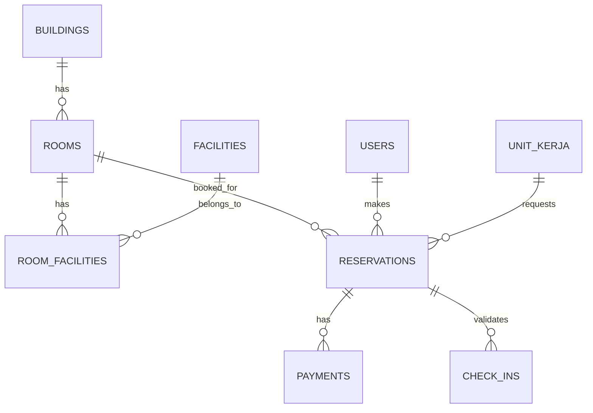
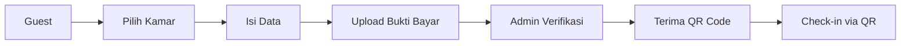
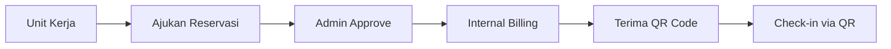

# Walkthrough: Membangun Sistem Manajemen Tim Housing UMY

## Gambaran Umum
Dokumen ini menjelaskan kebutuhan teknis dan langkah-langkah untuk membangun aplikasi Housing UMY.

---

## 1. Persiapan Environment

### Software yang Diperlukan
| Software | Versi | Keterangan |
|----------|-------|------------|
| PHP | 8.2+ | Requirement Laravel 12 |
| Composer | 2.x | Dependency manager PHP |
| Node.js | 20+ | Build assets (Vite) |
| MySQL | 8.0+ | Database |
| Git | Latest | Version control |

### Tools Development
- **IDE**: VS Code / PHPStorm
- **API Testing**: Postman / Insomnia
- **Database Client**: TablePlus / DBeaver

---

## 2. Instalasi Project Baru

### Step 1: Create Laravel 12 Project
```bash
composer create-project laravel/laravel housingumy
cd housingumy
```

### Step 2: Install Filament v4
```bash
composer require filament/filament:"^4.0"
php artisan filament:install --panels
```

### Step 3: Install Packages Pendukung
```bash
# Role & Permission
composer require spatie/laravel-permission

# QR Code Generator (untuk check-in)
composer require simplesoftwareio/simple-qrcode

# PDF Export (untuk laporan)
composer require barryvdh/laravel-dompdf
```

---

## 3. Struktur Database

### ERD Overview



### Tabel Utama

#### 1. Buildings (Gedung)
```php
Schema::create('buildings', function (Blueprint $table) {
    $table->id();
    $table->string('name'); // University Resident, Ma'had Ali, etc.
    $table->string('code')->unique();
    $table->text('address')->nullable();
    $table->text('description')->nullable();
    $table->boolean('is_active')->default(true);
    $table->timestamps();
});
```

#### 2. Rooms (Kamar)
```php
Schema::create('rooms', function (Blueprint $table) {
    $table->id();
    $table->foreignId('building_id')->constrained()->cascadeOnDelete();
    $table->string('room_number');
    $table->string('room_type'); // single, double, suite
    $table->integer('capacity')->default(1);
    $table->decimal('price_public', 12, 2); // Tarif publik
    $table->decimal('price_internal', 12, 2); // Tarif internal
    $table->enum('status', ['available', 'occupied', 'maintenance']);
    $table->timestamps();
});
```

#### 3. Facilities (Fasilitas)
```php
Schema::create('facilities', function (Blueprint $table) {
    $table->id();
    $table->string('name'); // AC, Wi-Fi, TV, etc.
    $table->string('icon')->nullable();
    $table->timestamps();
});
```

#### 4. Reservations (Reservasi)
```php
Schema::create('reservations', function (Blueprint $table) {
    $table->id();
    $table->string('reservation_code')->unique();
    $table->foreignId('room_id')->constrained();
    $table->foreignId('user_id')->constrained();
    $table->foreignId('unit_kerja_id')->nullable()->constrained();
    $table->enum('guest_type', ['mahasiswa', 'staf', 'dosen', 'umum', 'unit_kerja']);
    $table->date('check_in_date');
    $table->date('check_out_date');
    $table->decimal('total_price', 12, 2);
    $table->enum('status', ['pending', 'approved', 'rejected', 'checked_in', 'completed', 'cancelled']);
    $table->text('notes')->nullable();
    $table->timestamps();
});
```

#### 5. Payments (Pembayaran)
```php
Schema::create('payments', function (Blueprint $table) {
    $table->id();
    $table->foreignId('reservation_id')->constrained();
    $table->decimal('amount', 12, 2);
    $table->enum('payment_method', ['transfer', 'cash', 'internal_billing']);
    $table->enum('status', ['pending', 'verified', 'rejected']);
    $table->string('proof_file')->nullable();
    $table->timestamp('verified_at')->nullable();
    $table->foreignId('verified_by')->nullable()->constrained('users');
    $table->timestamps();
});
```

#### 6. Check-ins (Validasi QR)
```php
Schema::create('check_ins', function (Blueprint $table) {
    $table->id();
    $table->foreignId('reservation_id')->constrained();
    $table->string('qr_code')->unique();
    $table->timestamp('checked_in_at')->nullable();
    $table->timestamp('checked_out_at')->nullable();
    $table->foreignId('checked_by')->nullable()->constrained('users');
    $table->timestamps();
});
```

#### 7. Financial Transactions (Keuangan)
```php
Schema::create('financial_transactions', function (Blueprint $table) {
    $table->id();
    $table->foreignId('building_id')->constrained();
    $table->enum('type', ['income', 'expense']);
    $table->string('category');
    $table->decimal('amount', 12, 2);
    $table->text('description');
    $table->date('transaction_date');
    $table->foreignId('reservation_id')->nullable()->constrained();
    $table->foreignId('created_by')->constrained('users');
    $table->timestamps();
});
```

---

## 4. Struktur Filament Resources

### Modul 1: Manajemen Properti
- `BuildingResource` - CRUD Gedung
- `RoomResource` - CRUD Kamar dengan relasi gedung & fasilitas
- `FacilityResource` - Master data fasilitas

### Modul 2: Reservasi
- `ReservationResource` - Kelola reservasi
- Custom Pages:
  - `PublicReservationPage` - Form reservasi publik
  - `UnitKerjaReservationPage` - Form reservasi unit kerja

### Modul 3: Keuangan
- `FinancialTransactionResource` - Input pendapatan/belanja
- Custom Reports:
  - Laporan Laba Rugi
  - Laporan per Gedung

### Modul 4: Dashboard
- `StatsOverviewWidget` - Ringkasan okupansi
- `RevenueChartWidget` - Grafik pendapatan
- `OccupancyChartWidget` - Grafik okupansi

---

## 5. Role & Permission

| Role | Akses |
|------|-------|
| **Super Admin** | Full akses semua modul |
| **Admin Housing** | Kelola properti, reservasi, check-in |
| **Finance** | Input keuangan, lihat laporan |
| **Unit Kerja** | Buat reservasi internal |
| **Guest** | Reservasi publik |

---

## 6. Alur Reservasi

### Alur Publik (Personal)


### Alur Unit Kerja


---

## 7. Fitur QR Code Check-in

```php
// Generate QR saat reservasi approved
use SimpleSoftwareIO\QrCode\Facades\QrCode;

$qrCode = QrCode::format('png')
    ->size(300)
    ->generate($reservation->reservation_code);
```

---

## 8. Timeline Pengerjaan

| Fase | Durasi | Deliverables |
|------|--------|--------------|
| **Setup & Database** | 2-3 hari | Project setup, migrasi, seeder |
| **Modul Properti** | 3-4 hari | CRUD gedung, kamar, fasilitas |
| **Modul Reservasi** | 5-7 hari | Alur publik & internal, QR |
| **Modul Keuangan** | 3-4 hari | Transaksi, laporan |
| **Dashboard** | 2-3 hari | Widgets, charts |
| **Testing & Polish** | 3-4 hari | Bug fix, optimasi |

**Total Estimasi: 18-25 hari kerja**

---

## 9. Langkah Selanjutnya

1. ✅ Buat file `initial.md` (selesai)
2. ⏳ Setup project Laravel 12
3. ⏳ Install Filament v4
4. ⏳ Buat migrasi database
5. ⏳ Implementasi modul satu per satu
